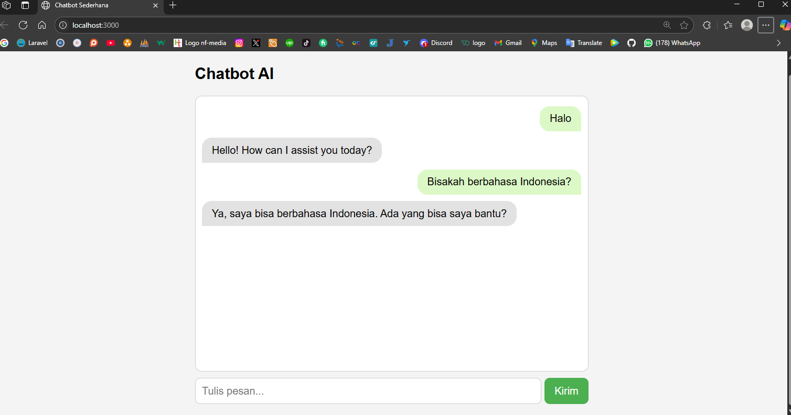

# 🤖 Chatbot Sederhana (Node.js)

Proyek ini adalah chatbot sederhana berbasis web yang terhubung ke backend menggunakan `Node.js`. Tampilan frontend menggunakan HTML/CSS bawaan dan mendukung chat bubble seperti aplikasi modern.

## 🚀 Fitur
- Kirim dan terima pesan via API `/chat`
- Tampilan bubble chat (seperti WhatsApp)
- Responsif dan ringan

---

## 📥 Cara Download dan Menjalankan

### 1. Clone Repositori

```bash
git clone https://github.com/naufalfirman23/pretest-xionxo-chat-bot.git
cd chat-bot
npm install
node server.js
```

Server berjalan di http://localhost:3000




